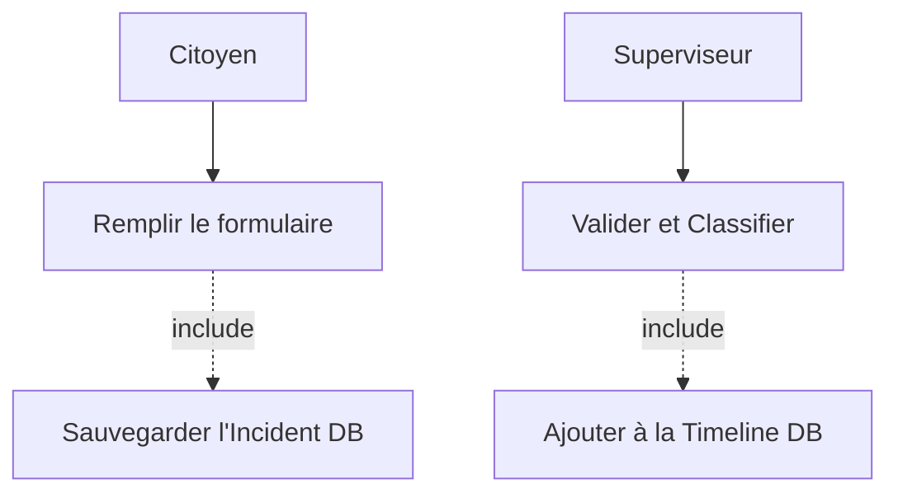
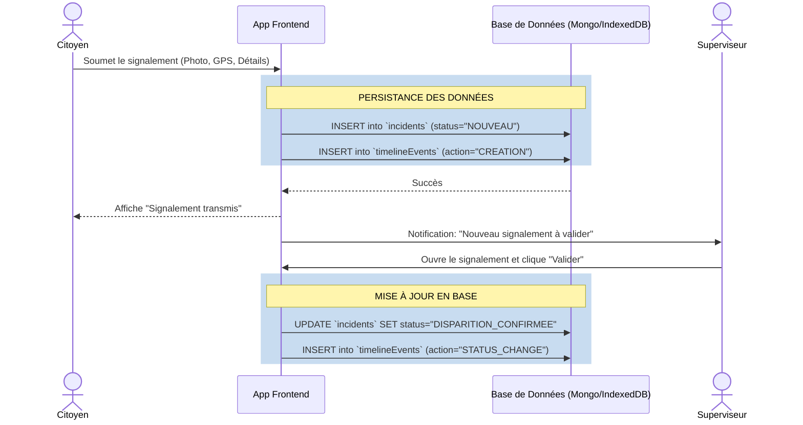
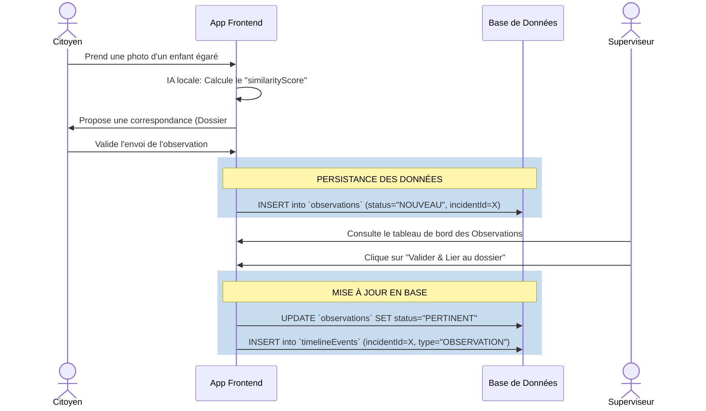
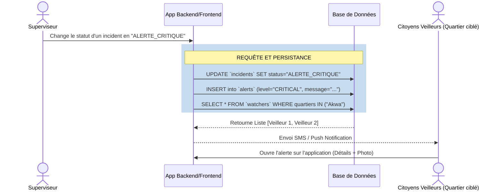
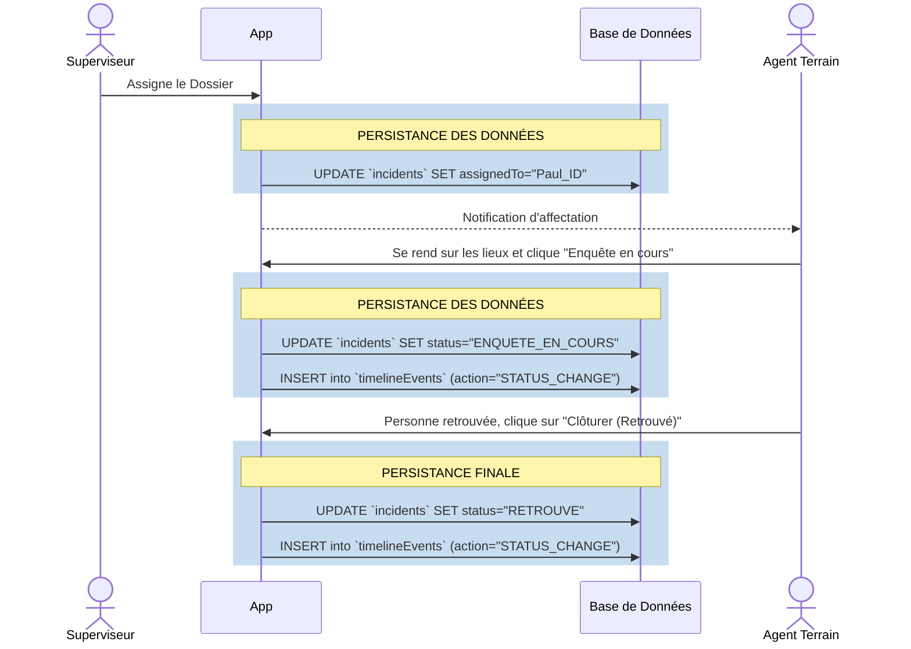

# Diagrammes Détaillés par Cas d'Utilisation

Ce document contient les diagrammes (Séquence et Cas d'Utilisation) spécifiques à chaque grande fonctionnalité de l'application SIGDU. Une attention particulière est portée sur la **persistance des données** (comment et où les données sont sauvegardées en base).

---

## 1. Cas d'Utilisation : Signalement d'une Disparition

Ce flux décrit comment un citoyen déclare une disparition et comment le backoffice prend le relais.

### Diagramme de Cas d'Utilisation


### Diagramme de Séquence avec Persistance


---

## 2. Cas d'Utilisation : Soumission et Traitement d'une Observation

Lorsqu'un citoyen signale avoir vu une personne correspondante, l'observation est stockée puis traitée par le superviseur.

### Diagramme de Cas d'Utilisation
```mermaid
usecaseDiagram
    actor "Citoyen" as C
    actor "Superviseur" as S
    
    usecase "Prendre photo / Saisir détails" as UC1
    usecase "Analyse IA (Matching local)" as UC2
    usecase "Enregistrer Observation (DB)" as UC3
    usecase "Lier au dossier Incident (DB)" as UC4

    C --> UC1
    UC1 ..> UC2 : <<include>>
    UC1 ..> UC3 : <<include>> (Persistance)
    
    S --> UC4
```

### Diagramme de Séquence avec Persistance


---

## 3. Cas d'Utilisation : Déclenchement du Réseau de Veilleurs

Ce flux montre comment l'application gère les alertes de proximité (Alerte Enlèvement).

### Diagramme de Cas d'Utilisation
```mermaid
usecaseDiagram
    actor "Superviseur" as S
    actor "Veilleur" as V
    
    usecase "Qualifier un Enlèvement" as UC1
    usecase "Rechercher Veilleurs dans la zone (DB)" as UC2
    usecase "Enregistrer Alerte (DB)" as UC3
    usecase "Recevoir Notification" as UC4

    S --> UC1
    UC1 ..> UC2 : <<include>>
    UC1 ..> UC3 : <<include>> (Persistance)
    V --> UC4
```

### Diagramme de Séquence avec Persistance


---

## 4. Cas d'Utilisation : Affectation et Résolution sur le Terrain

L'Agent reçoit son ordre de mission, se rend sur place et clôture l'intervention.

### Diagramme de Cas d'Utilisation
```mermaid
usecaseDiagram
    actor "Superviseur" as S
    actor "Agent Terrain" as A
    
    usecase "Affecter Dossier à Agent" as UC1
    usecase "Mettre à jour Enquête (DB)" as UC2
    usecase "Clôturer le Dossier (DB)" as UC3

    S --> UC1
    UC1 ..> UC2 : <<include>> (Persistance via Timeline)
    A --> UC3
```

### Diagramme de Séquence avec Persistance

