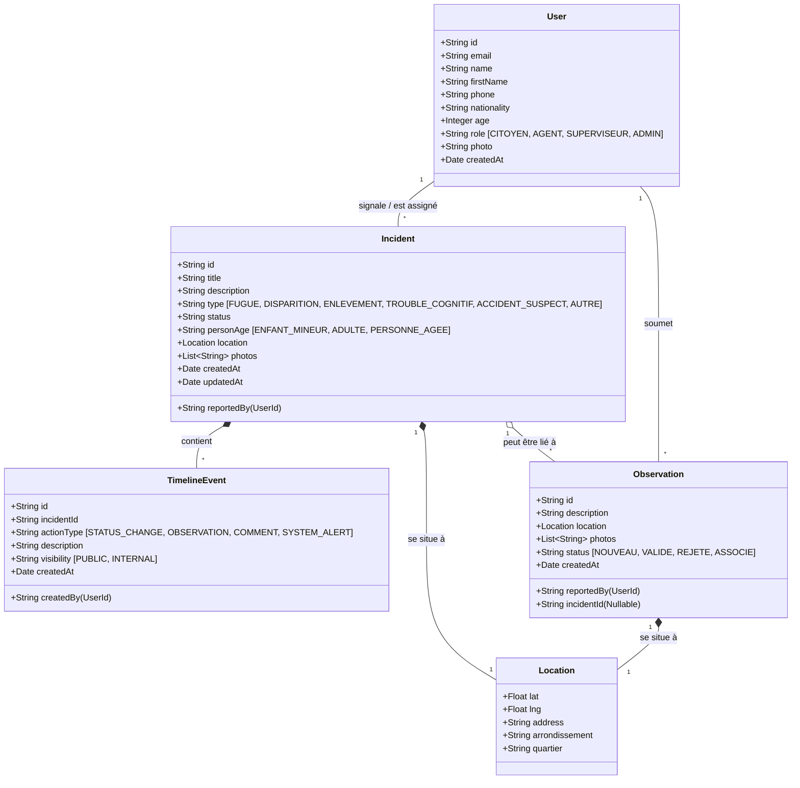

# Architecture Globale et Modélisation : SIGDU

Ce document compile les cas d'utilisation complets de la plateforme, le modèle de données (Diagramme de Classes) et le schéma JSON pour le reverse engineering.

---

## 1. Diagramme des Cas d'Utilisation (Complet)

Le diagramme suivant illustre l'ensemble des fonctionnalités du système réparties par acteur.

flowchart TD
    C["Citoyen"]
    CV["Citoyen Veilleur"]
    A["Agent Terrain"]
    S["Superviseur"]
    Admin["Administrateur"]

    %% Héritage d'acteurs
    CV -->|> C
    S --| A
    Admin --> S

    %% Fonctionnalités Citoyen
    subgraph "Espace Citoyen"
        UC_Signalement["Signaler une disparition/fugue"]
        UC_Obs["Soumettre une Observation"]
        UC_Rumeur["Vérifier/Soumettre une rumeur"]
    end

    C --> UC_Signalement
    C --> UC_Obs
    C --> UC_Rumeur

    %% Fonctionnalités Citoyen Veilleur
    subgraph "Réseau de Veille"
        UC_ZoneVeille["Gérer ses zones d'alerte"]
        UC_Alertes["Recevoir Alertes Push"]
    end
    
    CV --> UC_ZoneVeille
    CV --> UC_Alertes

    %% Fonctionnalités Agent Terrain
    subgraph "Opérations Terrain"
        UC_Affectations["Gérer ses affectations"]
        UC_UpdateEnquete["Mettre à jour l'enquête"]
    end

    A --> UC_Affectations
    A --> UC_UpdateEnquete

    %% Fonctionnalités Superviseur
    subgraph "Backoffice - Supervision"
        UC_ValiderSig["Valider les signalements"]
        UC_TraiterObs["Valider les observations"]
        UC_Dispatch["Affecter un Agent"]
        UC_TraiterRumeur["Gérer les rumeurs"]
    end

    S --> UC_ValiderSig
    S --> UC_TraiterObs
    S --> UC_Dispatch
    S --> UC_TraiterRumeur

    %% Fonctionnalités Administrateur
    subgraph "Administration Système"
        UC_Users["Gérer les utilisateurs"]
        UC_Config["Configurer l'application"]
    end

    Admin --> UC_Users
    Admin --> UC_Config

## 2. Diagramme de Classes (Modèle de Données)

Voici le diagramme de classes qui sous-tend la base de données (actuellement gérée par Dexie/IndexedDB, mais transposable sur PostgreSQL/MongoDB).



---

## 3. Schéma JSON (Pour Reverse Engineering / Base de données)

Ce schéma JSON peut être utilisé pour générer vos entités côté Backend (ex: Prisma, Mongoose, TypeORM) ou pour construire vos tables SQL.

```json
{
  "$schema": "http://json-schema.org/draft-07/schema#",
  "title": "SIGDU Schema",
  "type": "object",
  "properties": {
    "users": {
      "type": "array",
      "items": {
        "type": "object",
        "properties": {
          "id": { "type": "string", "format": "uuid" },
          "email": { "type": "string", "format": "email" },
          "name": { "type": "string" },
          "firstName": { "type": "string" },
          "phone": { "type": "string" },
          "nationality": { "type": "string" },
          "age": { "type": "integer" },
          "role": { "type": "string", "enum": ["CITOYEN", "AGENT", "SUPERVISEUR", "ADMIN"] },
          "photo": { "type": "string" },
          "createdAt": { "type": "string", "format": "date-time" }
        },
        "required": ["id", "email", "name", "role", "createdAt"]
      }
    },
    "incidents": {
      "type": "array",
      "items": {
        "type": "object",
        "properties": {
          "id": { "type": "string", "format": "uuid" },
          "reportedBy": { "type": "string", "description": "User UUID" },
          "assignedTo": { "type": "string", "description": "Agent UUID" },
          "title": { "type": "string" },
          "description": { "type": "string" },
          "type": { "type": "string", "enum": ["FUGUE", "DISPARITION", "ENLEVEMENT", "TROUBLE_COGNITIF", "ACCIDENT_SUSPECT", "AUTRE"] },
          "personAge": { "type": "string", "enum": ["ENFANT_MINEUR", "ADULTE", "PERSONNE_AGEE"] },
          "status": { "type": "string" },
          "location": {
            "type": "object",
            "properties": {
              "lat": { "type": "number" },
              "lng": { "type": "number" },
              "address": { "type": "string" },
              "arrondissement": { "type": "string" },
              "quartier": { "type": "string" }
            },
            "required": ["lat", "lng"]
          },
          "photos": {
            "type": "array",
            "items": { "type": "string" }
          },
          "createdAt": { "type": "string", "format": "date-time" },
          "updatedAt": { "type": "string", "format": "date-time" }
        },
        "required": ["id", "reportedBy", "title", "type", "status", "location", "createdAt"]
      }
    },
    "observations": {
      "type": "array",
      "items": {
        "type": "object",
        "properties": {
          "id": { "type": "string", "format": "uuid" },
          "reportedBy": { "type": "string" },
          "incidentId": { "type": "string", "description": "Linked incident UUID (nullable)" },
          "description": { "type": "string" },
          "location": {
            "type": "object",
            "properties": {
              "lat": { "type": "number" },
              "lng": { "type": "number" },
              "address": { "type": "string" },
              "quartier": { "type": "string" }
            },
            "required": ["lat", "lng"]
          },
          "photos": { "type": "array", "items": { "type": "string" } },
          "status": { "type": "string", "enum": ["NOUVEAU", "EN_COURS", "ASSOCIE", "REJETE"] },
          "createdAt": { "type": "string", "format": "date-time" }
        },
        "required": ["id", "reportedBy", "location", "status", "createdAt"]
      }
    },
    "timelineEvents": {
      "type": "array",
      "items": {
        "type": "object",
        "properties": {
          "id": { "type": "string", "format": "uuid" },
          "incidentId": { "type": "string" },
          "createdBy": { "type": "string" },
          "actionType": { "type": "string", "enum": ["STATUS_CHANGE", "OBSERVATION", "COMMENT", "SYSTEM_ALERT"] },
          "description": { "type": "string" },
          "visibility": { "type": "string", "enum": ["PUBLIC", "INTERNAL"] },
          "createdAt": { "type": "string", "format": "date-time" }
        },
        "required": ["id", "incidentId", "createdBy", "actionType", "visibility", "createdAt"]
      }
    }
  }
}
```

---

## Conclusion et Implémentation du Backoffice (Observations)

Pour répondre à votre question : **Non, la vue complète de gestion et de validation des observations par le Superviseur/Admin n'est pas encore développée dans le code.** 
Actuellement, le côté Citoyen permet de soumettre l'observation (qui est enregistrée dans la base de données), mais l'interface permettant au Superviseur de lister ces observations, de les accepter et de les lier à un dossier existant reste à construire. C'est la prochaine étape logique pour boucler le flux complet !
